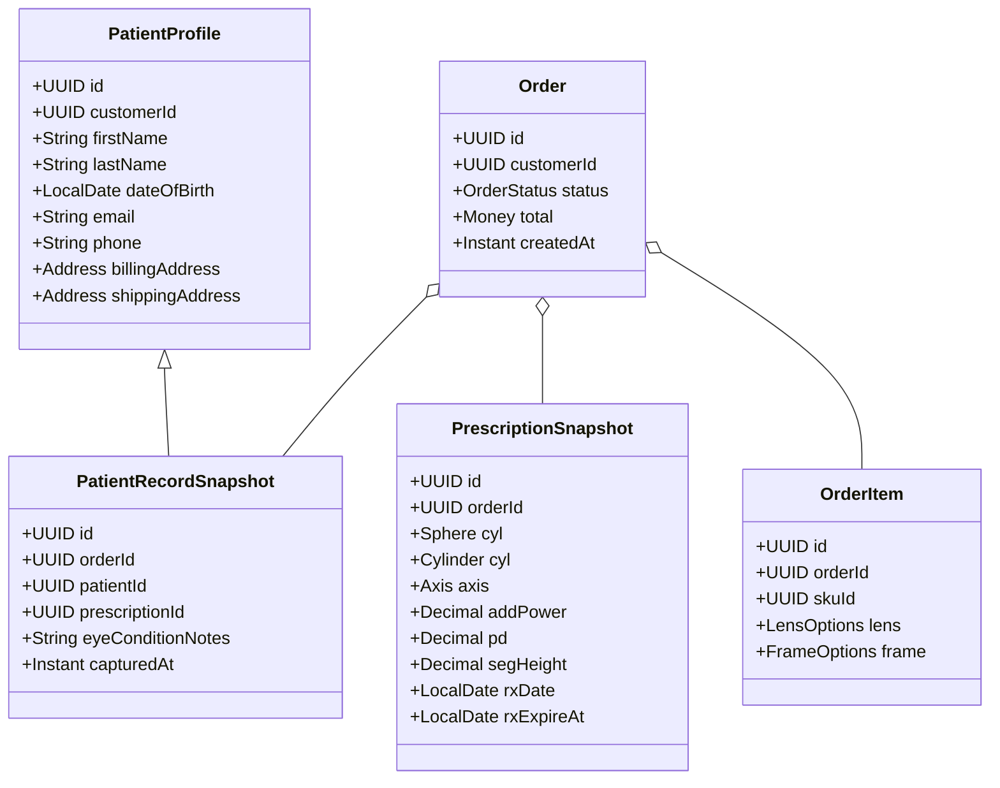

# Orders & Patient Data Design

## Purpose

Define how the Orders bounded context captures and exposes patient-specific data needed to process optical orders (frames, lenses, services) while preserving strong boundaries with the Customers and Lab contexts.

## Goals

- Store a consistent snapshot of patient information (demographics, Rx, measurements) with each order.
- Allow the Orders API to fetch all patient-related order data in a single call for admin/staff tools.
- Ensure Orders stays source of truth for order lifecycle while referencing canonical customer/patient records from the Customers context.
- Support downstream consumers (Lab, Fulfillment) through structured events and read models.

## Non-Goals

- Replacing the Customers module as the canonical patient profile store.
- Exposing PHI/PII directly to the storefront without consent or RBAC checks.
- Implementing the full Lab workflow (handled separately).

## Domain Model



## Data Ownership

- `customers_patients`, `customers_prescriptions`: owned by Customers context (canonical records).
- `orders_orders`, `orders_order_items`: owned by Orders context.
- `orders_patient_snapshots`, `orders_prescription_snapshots`: Orders context stores read-only snapshots captured at checkout for compliance and auditing.

## Database Schema (PostgreSQL)

```sql
-- Canonical patient profile (Customers module)
CREATE TABLE customers_patients (
  id UUID PRIMARY KEY,
  customer_id UUID NOT NULL,
  first_name TEXT NOT NULL,
  last_name TEXT NOT NULL,
  date_of_birth DATE,
  email TEXT,
  phone TEXT,
  metadata JSONB DEFAULT '{}'::JSONB,
  created_at TIMESTAMP WITH TIME ZONE DEFAULT now(),
  updated_at TIMESTAMP WITH TIME ZONE DEFAULT now()
);

-- Canonical prescription record (Customers module)
CREATE TABLE customers_prescriptions (
  id UUID PRIMARY KEY,
  patient_id UUID NOT NULL REFERENCES customers_patients(id),
  od JSONB NOT NULL,
  os JSONB NOT NULL,
  add_power NUMERIC(4,2),
  prism JSONB,
  pupillary_distance NUMERIC(5,2),
  segment_height NUMERIC(5,2),
  written_at DATE NOT NULL,
  expires_at DATE,
  doctor_name TEXT,
  doctor_license TEXT,
  created_at TIMESTAMP WITH TIME ZONE DEFAULT now(),
  updated_at TIMESTAMP WITH TIME ZONE DEFAULT now()
);

-- Orders context snapshot tables
CREATE TABLE orders_patient_snapshots (
  id UUID PRIMARY KEY,
  order_id UUID NOT NULL REFERENCES orders_orders(id) ON DELETE CASCADE,
  patient_id UUID NOT NULL,
  customer_id UUID NOT NULL,
  first_name TEXT NOT NULL,
  last_name TEXT NOT NULL,
  date_of_birth DATE,
  email TEXT,
  phone TEXT,
  billing_address JSONB NOT NULL,
  shipping_address JSONB NOT NULL,
  notes TEXT,
  captured_at TIMESTAMP WITH TIME ZONE DEFAULT now(),
  created_at TIMESTAMP WITH TIME ZONE DEFAULT now()
);

CREATE TABLE orders_prescription_snapshots (
  id UUID PRIMARY KEY,
  order_id UUID NOT NULL REFERENCES orders_orders(id) ON DELETE CASCADE,
  prescription_id UUID NOT NULL,
  od JSONB NOT NULL,
  os JSONB NOT NULL,
  add_power NUMERIC(4,2),
  prism JSONB,
  pupillary_distance NUMERIC(5,2),
  segment_height NUMERIC(5,2),
  written_at DATE NOT NULL,
  expires_at DATE,
  doctor_name TEXT,
  doctor_license TEXT,
  captured_at TIMESTAMP WITH TIME ZONE DEFAULT now(),
  created_at TIMESTAMP WITH TIME ZONE DEFAULT now()
);

CREATE INDEX idx_orders_patient_snapshots_order ON orders_patient_snapshots(order_id);
CREATE INDEX idx_orders_prescription_snapshots_order ON orders_prescription_snapshots(order_id);
```

## Workflow Overview

1. Checkout submits `customerId`, `patientId`, optional `prescriptionId`, contact info, and lens selections.
2. Orders Application Service fetches patient & prescription details from Customers module (query API or repository) within the same transaction boundary and persists snapshots.
3. Orders emits `orders.order.created` with embedded patient summary (non-sensitive fields or encrypted payload reference).
4. Lab and Fulfillment consume the event and fetch extended details from Orders `GET /orders/{id}/patient` endpoint using service-auth credentials.

## API Design

Base path: `/api/v1/orders`

- `GET /api/v1/orders/{orderId}` → includes `patientSummary` by default (name, Rx expiry, PD) for authorized users.
- `GET /api/v1/orders/{orderId}/patient` → returns complete patient snapshot (PII/PHI) with field-level filtering based on RBAC scopes (`orders:patient:read`).
- `POST /api/v1/orders` payload snippet:

```json
{
  "customerId": "...",
  "patient": {
    "id": "...",
    "contact": {
      "email": "...",
      "phone": "..."
    },
    "shippingAddressId": "...",
    "billingAddressId": "..."
  },
  "prescription": {
    "id": "...",
    "useLatest": true
  },
  "items": [
    {
      "skuId": "...",
      "quantity": 1,
      "lensSelection": {
        "design": "sv",
        "material": "polycarbonate",
        "coatings": ["ar"]
      }
    }
  ]
}
```

### Query Parameters

- `include=patient,prescription` → extends base order response with nested resources.
- `expand=labStatus` → fetches lab-specific read model (future work).

### Response Shape (`GET /orders/{id}/patient`)

```json
{
  "orderId": "...",
  "patient": {
    "firstName": "Jane",
    "lastName": "Doe",
    "dateOfBirth": "1989-02-04",
    "email": "jane@example.com",
    "phone": "+1-555-0100",
    "billingAddress": { "line1": "123 Main", "city": "Austin", "state": "TX" },
    "shippingAddress": { "line1": "123 Main", "city": "Austin", "state": "TX" },
    "notes": "Prefers contact via SMS"
  },
  "prescription": {
    "writtenAt": "2023-08-01",
    "expiresAt": "2025-08-01",
    "od": { "sphere": -1.25, "cylinder": -0.75, "axis": 90 },
    "os": { "sphere": -1.00, "cylinder": -0.50, "axis": 85 },
    "addPower": 0.00,
    "pupillaryDistance": 63.5,
    "segmentHeight": 18.0
  }
}
```

## Service Interfaces

```typescript
// Customers module query facade
export interface PatientQueryService {
  getPatientProfile(patientId: string, tenantId: string): Promise<PatientProfile>;
  getPrescription(prescriptionId: string, tenantId: string): Promise<Prescription>;
  getLatestPrescription(patientId: string, tenantId: string): Promise<Prescription | null>;
}

// Orders application service
export interface OrderApplicationService {
  createOrder(input: CreateOrderCommand): Promise<OrderAggregate>;
  getOrderWithPatient(orderId: string, tenantId: string): Promise<OrderAggregate>;
}
```

## Event Payload (Example)

```json
{
  "type": "orders.order.created",
  "version": 1,
  "orderId": "...",
  "tenantId": "...",
  "occurredAt": "2024-03-10T18:14:22.531Z",
  "patient": {
    "firstName": "Jane",
    "lastName": "Doe",
    "dateOfBirth": "1989-02-04",
    "prescriptionExpiresAt": "2025-08-01",
    "pupillaryDistance": 63.5
  }
}
```

Sensitive fields (email, phone, address) can be encrypted or omitted based on subscriber.

## Security & Compliance

- Encrypt PII columns (email, phone) at rest using Postgres column-level encryption or application-layer envelope encryption.
- Mask patient data in logs; propagate correlation ID without personal data.
- Enforce RBAC scopes for endpoints returning PHI, audited via `orders_access_audit` table.

## Open Questions

1. Should prescriptions be versioned per order item (e.g., different Rx per lens)?
2. Do we allow manual overrides of patient contact info per order?
3. What is the retention policy for patient snapshots relative to data privacy regulations?

## Next Steps

- Finalize Rx data contract with Lab team and update schema if additional fields required.
- Align RBAC scopes with security team.
- Implement persistence and API endpoints (see backend module skeleton).
