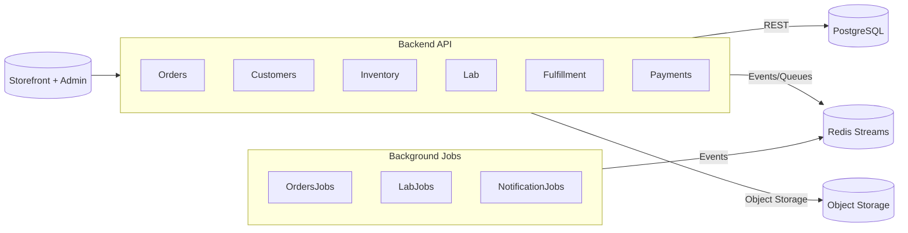
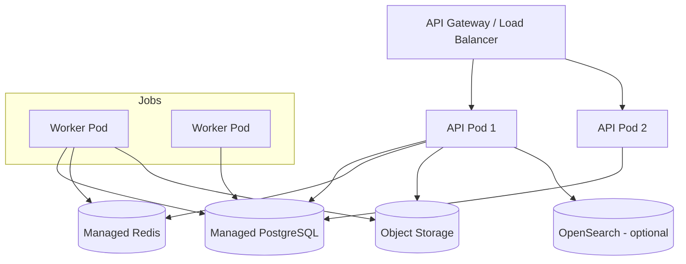

# Optical ERP Technical Architecture (TOGAF-Aligned)

## Document Purpose

Describe the Optical ERP solution architecture using TOGAF Architecture Development Method (ADM) artifacts for technical stakeholders, including architects, engineers, and delivery teams.

## Audience

- Enterprise and solution architects
- Engineering leads and developers
- Infrastructure and DevOps teams
- Security, compliance, and data governance teams

## ADM Phase Alignment

| ADM Phase | Technical Deliverable |
|-----------|----------------------|
| Architecture Vision | Solution overview, scope, principles |
| Business Architecture | Capability mapping, process support |
| Data Architecture | Canonical models, ownership, integration |
| Application Architecture | Modules, services, interfaces |
| Technology Architecture | Runtime topology, infrastructure components |
| Opportunities & Solutions | Architecture Building Blocks (ABBs) to Solution Building Blocks (SBBs) mapping |
| Migration Planning | Roadmap, work packages |
| Implementation Governance | Architecture decision records, compliance checkpoints |
| Architecture Change Management | Metrics, governance forums |

## Architecture Vision

### Scope & Principles

- **Scope**: Optical retail ERP covering catalog, pricing, customers, orders, payments, inventory, lab, fulfillment, and integrations.
- **Architecture Style**: Modular monolith (NestJS/TypeScript) with clear bounded contexts and event-driven extensions.
- **Principles**:
  1. **Modularity First** – Isolate bounded contexts with explicit APIs and events.
  2. **Patient Data Stewardship** – Treat prescription/PII data as high-sensitivity assets with snapshots captured in Orders.
  3. **Idempotent Workflows** – Ensure repeatable operations (checkout, lab updates) via idempotency keys and event dedupe.
  4. **Evolvability** – Design for service extraction (strangler) without disrupting core flows.

## Business Architecture Summary

- Capabilities aligned to module responsibilities (see `modularity.md`).
- Business processes (Order Capture, Lab Fulfillment, Returns) are orchestrated by the Orders module and supported by Lab, Inventory, and Fulfillment modules via domain events.
- Key business services: `orders.order.created`, `lab.work_order.stage_changed`, `inventory.stock.reserved`.

## Data Architecture

### Canonical Data Model Overview

| Context | Primary Entities | Notes |
|---------|------------------|-------|
| Customers | Patient, Prescription, Contact Preference | Canonical source for patient demographics and Rx |
| Orders | Order, OrderItem, PatientSnapshot, PrescriptionSnapshot | Snapshot copies stored per order |
| Inventory | StockLevel, Reservation, TransferOrder | Tenant-aware, location-scoped |
| Lab | WorkOrder, StageHistory, QAResult | Consumes order snapshots |

### Data Ownership & Access Patterns

- **Customers schema** owns `customers_patients`, `customers_prescriptions`.
- **Orders schema** stores operational tables plus snapshot tables (`orders_patient_snapshots`, `orders_prescription_snapshots`).
- **Lab schema** references order ID and snapshot IDs only; no direct patient edits.
- Access via repositories; no cross-schema writes outside owning module.

### Integration Patterns

- Synchronous REST queries for canonical reads (Customers → Orders).
- Outbox-driven events for async propagation (Orders → Lab/Fulfillment).
- Domain events published with dedupe keys and correlation IDs.

### Data Lifecycle & Compliance

- Patient snapshots retained per regulatory requirements (default 7 years, configurable).
- Encryption at rest for PII columns; option for application-level envelope encryption.
- Audit tables: `orders_access_audit`, `customers_consent_history`.

## Application Architecture

### Module Topology

### Orders Module Components

- **Application Layer**: `OrderService` orchestrates order creation, snapshot capture, repository interactions (`backend/src/modules/orders/application/order-service.ts`).
- **Domain Layer**: Aggregates and entities representing orders, order items, patient/prescription snapshots (`backend/src/modules/orders/domain/*`).
- **Infrastructure Layer**: Repository interfaces and adapters (in-memory today, extensible for Postgres) (`backend/src/modules/orders/infrastructure/*`).
- **Interface Layer**: HTTP controller stubs aligning with REST endpoints and RBAC scopes (`backend/src/modules/orders/interfaces/http/orders.controller.ts`).
- **Lab Print Service**: Generates PDF or thermal tickets with QR-coded work order IDs, frame geometry, lens edging parameters, tint/coating notes, and optional STL file metadata for additive manufacturing; validated against Epson TM-T88VII (ESC/POS) thermal printers and compatible CUPS-connected devices.

### Interfaces & Contracts

- `CreateOrderCommand` / `CreateOrderRequestDto` define inbound order creation payloads with patient and prescription references.
- `PatientQueryService` facade decouples Orders from Customers module for patient data retrieval.
- `PatientSnapshotRepository` persists snapshots, enabling lab and compliance queries.

### Deployment Views (Logical)

| Tier | Components | Notes |
|------|------------|-------|
| Presentation | Next.js Storefront, Admin portal | Serves customer/staff UIs |
| Application | NestJS API (Monolith), Worker processes | Shares codebase, separated runtimes in P2+ |
| Data | PostgreSQL, Redis, Object Storage, OpenSearch (optional) | Single schema with module prefixes for MVP |

## Technology Architecture

### Runtime Environment

- **Language/Framework**: Node.js 20+, NestJS (API), TypeScript modules.
- **Database**: PostgreSQL 15 with schema-per-module pattern readiness.
- **Caching/Queue**: Redis for cache, queues, distributed locks.
- **Object Storage**: S3-compatible for Rx documents, media.
- **Search**: OpenSearch optional for product and order search.

### Infrastructure Topology (P2 Deployment)

### Cross-Cutting Concerns

- **Observability**: OpenTelemetry tracing, structured logs with correlation IDs, Prometheus metrics (RED).
- **Security**: OIDC provider, JWT/opaque token validation, policy-based access control (ABAC extension ready).
- **Resilience**: Circuit breakers for external providers, retry with exponential backoff, DLQ for failed jobs.
- **Print Reliability**: Spooler queue monitoring with retries/backoff, checksum validation for printable assets (PDF/STL), fallback notifications when devices are offline, and printer capability detection (paper width, ESC/POS commands) tuned for Epson TM-T88VII and similar receipt printers.

## Architecture Building Blocks (ABBs)

| ABB | Description | Implemented By |
|-----|-------------|----------------|
| Order Creation Service | Coordinates order lifecycle | `OrderService` (application) |
| Patient Snapshot Capture | Retrieves and stores patient/prescription data | `PatientQueryService`, `PatientSnapshotRepository` |
| Event Outbox | Guarantees reliable event dispatch | Planned (`orders_outbox` table) |
| RBAC Enforcement | Protects patient data access | Request context + scope checks |
| Reporting Views | Aggregated data for KPIs | Future read models / analytics layer |

## Solution Building Blocks (SBBs)

| SBB | Status | Notes |
|-----|--------|-------|
| PostgreSQL schema migrations | Planned | Implement via Prisma/TypeORM or SQL migrations |
| NestJS module wiring | Planned | Compose modules with DI, interceptors, guards |
| Infrastructure as Code | Planned | Terraform/CloudFormation for managed services |
| CI/CD pipeline | Planned | GitHub Actions with lint/build/test/deploy stages |
| Monitoring stack | Planned | Prometheus/Grafana/ELK integration |

## Baseline vs Target Architecture

| Layer | Baseline (MVP) | Target (Pro/Enterprise) |
|-------|----------------|------------------------|
| Application | Modular monolith, in-memory adapters for dev | Split API/Worker, eventual microservices for Lab/Payments |
| Data | Single schema, module-prefixed tables | Per-module schemas, data warehouse feed |
| Integration | Direct REST + webhooks | Event-driven bus, partner API gateway |
| Security | RBAC, MFA | ABAC, fine-grained consent, SIEM integration |
| Ops | Manual deployments | Automated blue/green, SLO-based scaling |

## Migration Planning & Roadmap

### Work Packages

1. **WP-01**: Implement PostgreSQL repositories for Orders snapshots.
2. **WP-02**: Integrate Customers module service for patient/prescription data (real adapter).
3. **WP-03**: Add event outbox and publish `orders.order.created` with patient summary.
4. **WP-04**: Build NestJS HTTP controllers with validation, guards, and OpenAPI docs.
5. **WP-05**: Deploy staging environment with observability instrumentation.

### Transition Architecture Milestones

- **Milestone A**: MVP monolith with manual lab updates.
- **Milestone B**: Worker split (P2), event-driven lab updates.
- **Milestone C**: Service extraction for Lab (P3), partner integrations.

## Implementation Governance

- Architecture Decision Records (ADRs) logged per significant change.
- Code reviews enforce module boundaries and dependency rules.
- Security reviews before enabling patient data endpoints.
- Performance testing gates before scaling rollout.
- Compliance checklist per release (PII handling, audit logging).

## Architecture Change Management

- Monthly architecture guild reviewing KPIs, incidents, and tech debt.
- Metrics dashboard: order latency, lab cycle time, snapshot consistency, error budgets.
- Change backlog maintained in architectural Kanban (To-Do/In Review/Approved/Implemented).
- Deprecated APIs flagged in release notes with sunset timelines.

## Appendices

- **A. Related Documents**: `overview.md`, `modularity.md`, `orders_patient_data.md`, `togaf-user-guide.md`.
- **B. Glossary**: ABB, SBB, ADM, PD (Pupillary Distance), Rx, RMA, SLA.
- **C. Compliance References**: HIPAA (US), GDPR (EU) considerations for patient data.
